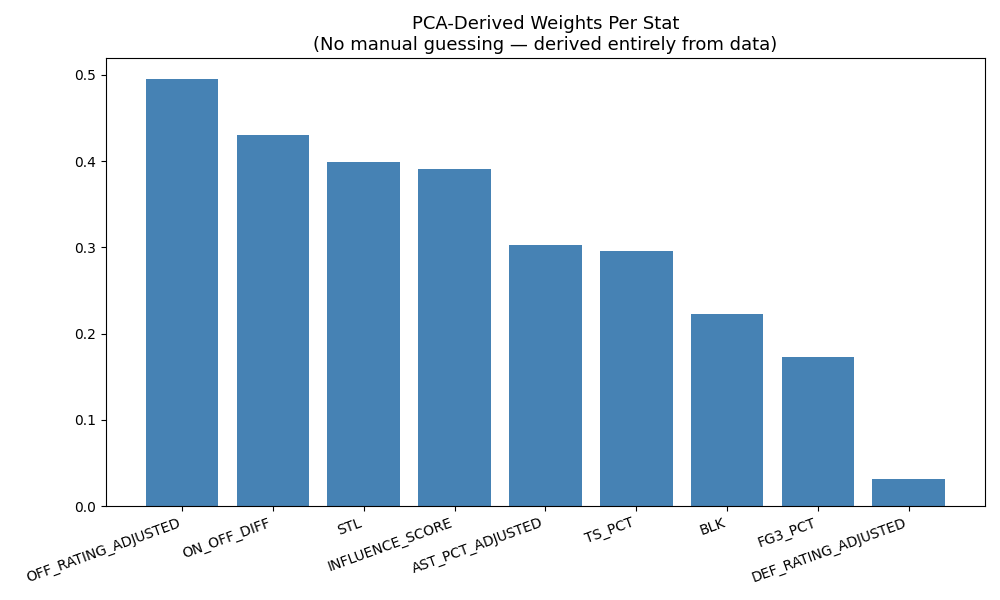
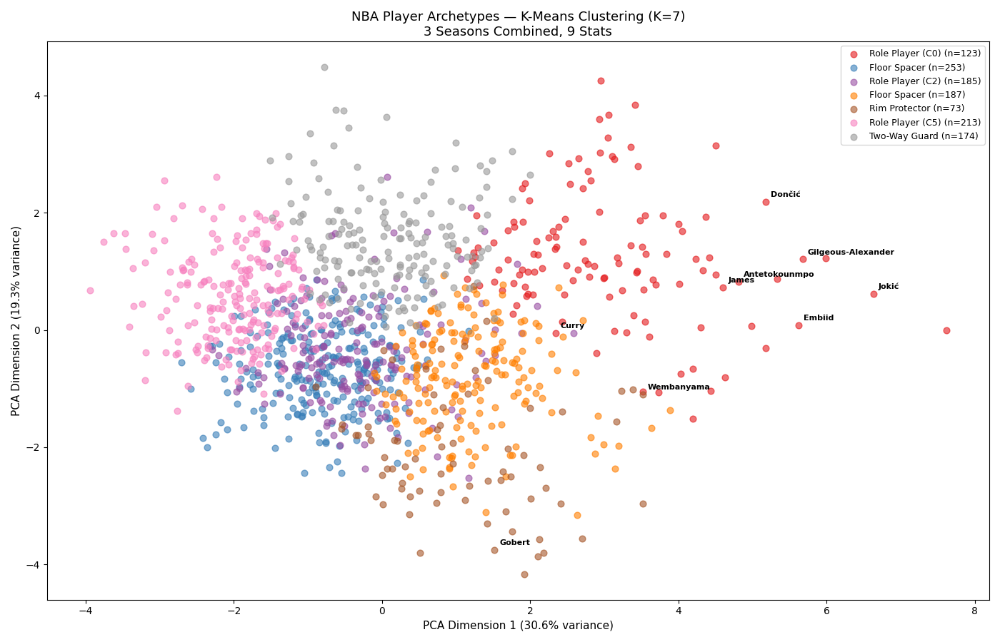
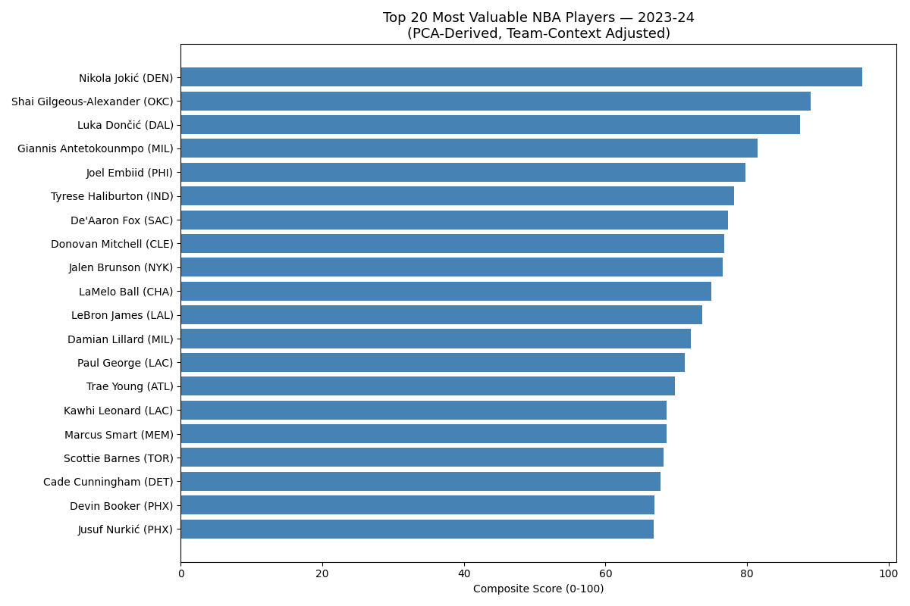

===
# NBA Roster Optimizer
**A workforce-optimization problem dressed in basketball clothes.**
Given a $136M salary cap, position requirements, archetype balance, and chemistry constraints — what is the statistically optimal 15-man roster?
Underneath the basketball, this is the same shape of problem an HR or operations analytics team solves when planning headcount, compensation, and skill mix under a fixed budget. The data is just public.
---
## What this project does
1. Pulls 3 seasons of NBA data (1,200+ player-seasons) from the public NBA Stats API
2. Derives a single 0–100 score per player using PCA-weighted, Bayesian-shrunk, residualized stats
3. Discovers player archetypes via K-Means clustering
4. Computes pairwise on-court synergy from two-man lineup data
5. Solves a Mixed-Integer Linear Program to build the optimal 15-man roster across 10 team-building scenarios (rebuild, win-now, small-ball, Moneyball, balanced, and more)
---
## A few visuals
| | |
|---|---|
|  |  |
| *PCA-derived weights for player scoring (vs. guessed weights)* | *K-Means archetype clusters in 2D projection* |

*Top 20 player-seasons by the final composite score*
---
## Methodology highlights
| Technique | Why it's here |
|---|---|
| **PCA** | Derive scoring weights from the data instead of guessing which stats matter |
| **Bayesian shrinkage** | Stop small samples from inflating ratings. Applied to TS%, FG3%, and minutes-weighted to advanced stats like ON_OFF_DIFF. Prior strengths derived from MSE cross-validation (TS prior ≈ 275 shots, FG3 prior ≈ 260 attempts) |
| **K-Means clustering** | Discover player archetypes (the same technique used for workforce skill segmentation) |
| **Pearson + Spearman correlation** | Keep only stats that actually predict winning |
| **OLS residualization** | Strip "good teammate" halo effects from individual scores |
| **Mixed-Integer Linear Programming** | Optimize under salary, position, and chemistry constraints simultaneously |
Full methodology writeups live in the docs/pipeline/ folder.
---
## Limitations
Honest boundaries of the model — documented because knowing where an analysis breaks is part of the analysis.

- **Optimization scope — model vs. selection.** The PCA scoring model is *fit* on all 1,200+ player-seasons across three seasons (recency-weighted), so every player is scored on one common, stable scale. But the MILP optimizer only *selects* from the most recent (2023-24) pool of ~399 players. This is deliberate — the goal is to build a roster from currently available players, judged on their most recent performance — but it has two consequences: (a) players from earlier seasons aren't selectable, and (b) each player's optimizer input is their single most-recent-season score rather than a multi-season blend, so an outlier 2023-24 season is taken at face value. A multi-season talent estimate (a recency-weighted blend, or a state-space / Kalman-filter approach) would smooth this — but it changes the objective from *evaluating the current pool* to *projecting future performance*, which is a different question.
- **Individual defense is hard to isolate.** Team defensive rating is shared across all five players on the floor, so individual defensive credit is noisy. DEF_RATING_ADJUSTED ends up with a low PCA weight (~0.04); STL and BLK carry most of the defensive signal because they're individually attributable. Public data doesn't expose the tracking metrics that would fully fix this.
- **Positionless players.** BLK/STL are compared within position groups inferred from rebounding percentiles. This works for most players but misclassifies positionless stars (LeBron, Draymond Green, Bam Adebayo) who rebound like bigs but defend like guards — a known hard problem in basketball analytics.
- **Salaries** for prior seasons are historical approximations scaled by cap ratio; current-season figures are actuals.
---
## Repository layout
- 01_feature_engineering.py — Raw stats → PCA-weighted, shrunk, residualized features
- 02_clustering.py — K-Means → player archetypes
- 03_fix_labels.py — Human-readable archetype labels
- 04_optimizer_expanded.py — Baseline MILP optimizer (no synergy)
- 05_compute_synergy.py — Pairwise on-court synergy from lineup data
- 06_validate_synergy.py — Synergy sanity checks
- 07_optimizer_synergy.py — Full MILP with synergy + archetype constraints
- 08_build_dashboard.py — Static dashboard generation
- 09_verify_pipeline.py — End-to-end pipeline verification
- 11_generate_pipeline_docs.py — Auto-generate docs/pipeline/ markdown
- _mse_analysis.py — MSE cross-validation that derived shrinkage priors
- build_database.py — Populate SQLite database from CSVs
- build_interactive_dashboard.py / build_enhanced_dashboard.py
- build_pptx.py — Generate slide deck
- build_tableau_data.py — Tableau-ready exports
- optimizer.py / fix_salaries.py
- deliverables/dashboards/ — Interactive HTML dashboards
- deliverables/excel/ — Excel workbook
- deliverables/presentation/ — Slide deck (PPTX)
- deliverables/charts/ — Methodology figures (PCA, clusters, archetypes)
- deliverables/tableau/ — Tableau-ready CSVs + setup guide
- docs/pipeline/ — Per-step methodology writeups
- sql/ — SQL queries + DB Browser project file
- nba_optimizer.db — SQLite database (8 tables, 6 views)
- nba_*.csv — Raw + processed datasets
- optimized_roster_*.csv — Optimizer outputs (10 scenarios × 2 variants)
---
## Key deliverables to look at first
- Interactive dashboard: deliverables/dashboards/NBA_Enhanced_Dashboard.html — open in a browser
- Excel workbook: deliverables/excel/NBA_Optimizer_Dashboard.xlsx
- Slide deck: deliverables/presentation/NBA_Optimizer_Presentation.pptx
- Methodology figures: deliverables/charts/
- Pipeline writeups: docs/pipeline/
---
## Running the pipeline
Scripts assume the repository root as the working directory and run in numeric order (01 → 09). Dependencies: pandas, numpy, scikit-learn, scipy, statsmodels, pulp (for MILP), nba_api, plotly, openpyxl, python-pptx.
Run them in order:
    python 01_feature_engineering.py
    python 02_clustering.py
    python 03_fix_labels.py
    python 04_optimizer_expanded.py
    python 05_compute_synergy.py
    python 06_validate_synergy.py
    python 07_optimizer_synergy.py
    python 08_build_dashboard.py
    python 09_verify_pipeline.py
The SQL database can be regenerated with `python build_database.py` and explored via DB Browser for SQLite by opening sql/nba_optimizer.sqbpro. Example queries are in sql/sql_queries.sql.
---
## A note on how this was built
I directed and designed every analytical decision in this project: choosing PCA over guessed weights, applying Bayesian shrinkage so 50% on 26 threes doesn't equal 50% on 500, deriving prior strengths via MSE cross-validation instead of picking them by feel, residualizing to strip teammate halo effects, and framing roster construction as a MILP under simultaneous constraints. AI assisted with implementing the Python and assembling the deliverables (Excel workbook, dashboards, slide deck).
I write SQL myself and use it to explore and validate the output — it's how I caught a 22-game player wrongly ranking top-5 overall, and other small-sample artifacts. Power BI work is in progress.
The most valuable skill this project taught me wasn't any single tool — it was catching when my own model was wrong.
===